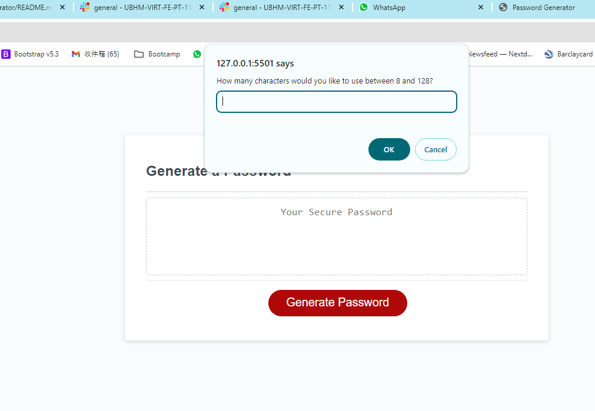
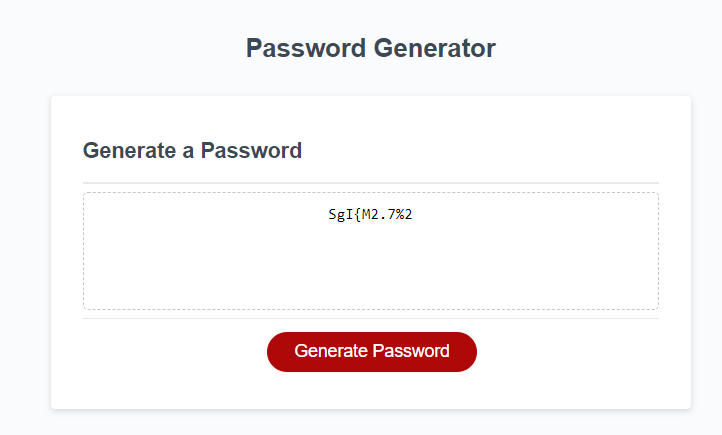

# Password Generator

## Description 
 *create an application that an employee can use to generate a random password based on criteria
 *Generate a password when the button is clicked
  - Present a series of prompts for password criteria
  1. Length of password
    - At least 8 characters but no more than 128.
  2.  Character types
    - Lowercase
    - Uppercase
    - Numeric
    - Special characters ($@%&*, etc)

## Installation

* using JavaScript;
* using "for loop" and if statement

## Usage 

* showed the result there.

Result if using all charactors

## Credits

Very graceful to have below teammate and TA for working the codes together;
Thanks for @ Dylan, Sing and Patrick

## License

MIT licence
---

## Badges
N/A

## Features

* showed the result there.

## Contributing

N/A

## Tests

*tested all var and console logs.